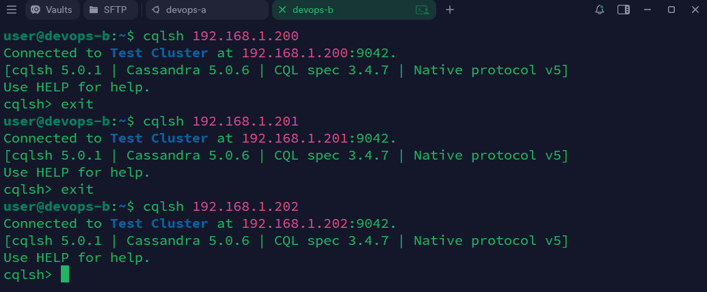
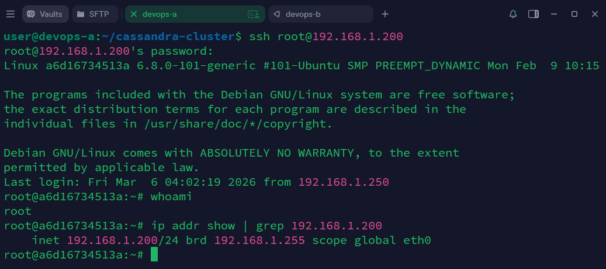

# DevOps-Docker тестовое задание

Создать Docker Compose скрипт для развертки кластера из трех инстансов cassandra, причем каждый из них должен быть доступен из основной (локальной) сети по отдельному ip адресу.

## Задание

1. На машине А (ubuntu 24.04 lts) в локальной сети с ip 192.168.1.197 запускается скрипт docker-compose для поднятия 3 образов с ip адресами 192.168.1.200-202.
2. Затем с машины Б (ubuntu 24.04 lts) из той же локальной сети с ip 192.168.1.198 необходимо подключиться через cqlsh к каждой из машин-образов.
3. Настроить ssh для возможности подключения к 1.200 с 1.197
4. Все приведённые операции необходимо задокументировать и описать инструкцией с командами и объяснениями в Readme
5. Добавить скриншот результата в Readme.

## 1. Подготовка виртуальных машин

Для выполнения задания были подняты две виртуальные машины с Ubuntu 24.04 LTS:
* Host A: IP 192.168.1.197 - кластер Cassandra
* Host B: IP 192.168.1.198 - для подключения через cqlsh

### Настройка сети VM

Для каждой из машин: Настройки → Сеть → Адаптер 1 → Тип подключения: Сетевой мост. Это необходимо для обеспечения им доступа к локальной сети и возможности присвоить статический IP.

На каждой из машин необходимо задать статический IP адрес (192.168.1.197/198).

Для этого необходимо узнать имя сетевого адаптера командой `ip addr`. Пример вывода:

```cmd
1: lo: <LOOPBACK,UP,LOWER_UP> mtu 65536 qdisc noqueue state UNKNOWN group default qlen 1000
    link/loopback 00:00:00:00:00:00 brd 00:00:00:00:00:00
    inet 127.0.0.1/8 scope host lo
       valid_lft forever preferred_lft forever
    inet6 ::1/128 scope host noprefixroute
       valid_lft forever preferred_lft forever

2: enp0s3: <BROADCAST,MULTICAST,UP,LOWER_UP> mtu 1500 qdisc fq_codel state UP group default qlen 1000
    link/ether 08:00:27:35:fc:dc brd ff:ff:ff:ff:ff:ff
    inet 192.168.1.15/24 metric 100 brd 192.168.1.255 scope global dynamic enp0s3
       valid_lft 84878sec preferred_lft 84878sec
    inet6 fe80::a00:27ff:fe35:fcdc/64 scope link
       valid_lft forever preferred_lft forever
```

Здесь `lo` это loopback интерфейс а `enp0s3` в этом случае - основной сетевой интерфейс, его используем при настройке netplan.

Создаем файл в который записываем конфигурацию с сетевым интерфейсом и статическим IP:
```bash
sudo nano /etc/netplan/00-net.yaml
``` 

```yaml
network:
  version: 2
  ethernets:
    enp0s3:
      dhcp4: no
      addresses: [192.168.1.197/24]
      nameservers:
        addresses: [8.8.8.8, 8.8.4.4]
      routes:
        - to: default
          via: 192.168.1.1
```

**Пояснение**:
* dhcp4: no - отключаем DHCP, чтобы задать статический IP
* addresses - IP адрес вашей VM (Для машины B - 192.168.1.198)
* nameservers - DNS, в данном случае Google (8.8.8.8, 8.8.4.4)
* routes - маршрут по умолчанию через ваш шлюз

Далее применяем конфигурацию

```bash
sudo chmod 600 /etc/netplan/00-net.yaml # Избежать предупреждение об ограничении прав доступа
sudo netplan apply
```

Проверка успешной настройки сети

```bash
ip addr show <имя сетевого интерфейса> | grep inet
```
Ожидаемый результат

```cmd
inet 192.168.1.197/24 metric 100 brd 192.168.1.255 scope global <имя сетевого интерфейса>
```

Дополнительная проверка связи:

```bash
ping 8.8.8.8  # Проверка интернета
ping 192.168.1.1  # Проверка шлюза
```

### Настройка SSH доступа к VM (опционально, для удобства)

Для удобства работы и возможности подключиться из **PuTTY/Termius/iTerm2** вместо VirtualBox консоли.

**На каждой VM (Host A и B) выполнить:**

```bash
sudo apt update
sudo apt install -y openssh-server
sudo systemctl enable --now ssh
```

Проверка:
```bash
sudo systemctl status ssh
ss -tuln | grep 22
```

Ожидаемый результат
```cmd
...
    Active: active (running)
...
tcp      ...           0.0.0.0:22         0.0.0.0:*          
tcp      ...              [::]:22            [::]:*
```

## 2. Установка Docker и Docker Compose

На машине A необходимо установить Docker и Docker Compose.
```bash
sudo apt update
sudo apt install -y docker.io docker-compose-v2
sudo systemctl enable --now docker
sudo usermod -aG docker $USER
newgrp docker
```

Проверка
```bash
docker --version
docker compose version
```

Ожидаемый результат
```cmd
Docker version x.x.x, build ...
Docker Compose version v2.x.x
```

## 3. Создание ipvlan сети и docker-compose.yml

### Создание сети


```bash
docker network create -d ipvlan \
    --subnet=192.168.1.0/24 \
    --gateway=192.168.1.1 \
    -o parent=<имя сетевого интерфейса> \
    cassandra_network
```


Проверка
```bash
docker network ls | grep cassandra_network
docker network inspect cassandra_network
```

Ожидаемый результат
```cmd
cassandra_network   ipvlan    local

[
    {
        "Name": "cassandra_network",
        "Id": "...",
        "Created": "...",
        "Scope": "local",
        "Driver": "ipvlan",
        ...
    }
]
```

### Файловая структура
```
/home/<username>/
└─ cassandra-cluster/
   ├─ cassandra-1/
   │  └─ Dockerfile
   └─ docker-compose.yml
```

### Dockerfile для первого экземпляра Cassandra
```docker
FROM cassandra:latest

RUN apt-get update && \
    apt-get install -y openssh-server && \
    mkdir /var/run/sshd && \
    echo 'root:root' | chpasswd && \
    sed -i 's/#PermitRootLogin.*/PermitRootLogin yes/' /etc/ssh/sshd_config && \
    sed -i 's/#PasswordAuthentication.*/PasswordAuthentication yes/' /etc/ssh/sshd_config && \
    rm -rf /var/lib/apt/lists/*

EXPOSE 22

CMD ["/bin/bash", "-c", "/usr/sbin/sshd && exec docker-entrypoint.sh cassandra -f"]
```

Пояснения:
* Устанавливаем openssh-server в Cassandra образ
* root:root - логин/пароль для SSH

### docker-compose.yml

```yaml
version: "3.9"

x-cassandra-defaults: &cassandra-defaults
  environment:
    MAX_HEAP_SIZE: 512M
    HEAP_NEWSIZE: 128M

services:
  cassandra-1:
    build: ./cassandra-1
    container_name: cassandra-1
    <<: *cassandra-defaults
    networks:
      cassandra_network:
        ipv4_address: 192.168.1.200

  cassandra-2:
    image: cassandra:latest
    container_name: cassandra-2
    <<: *cassandra-defaults
    networks:
      cassandra_network:
        ipv4_address: 192.168.1.201

  cassandra-3:
    image: cassandra:latest
    container_name: cassandra-3
    <<: *cassandra-defaults
    networks:
      cassandra_network:
        ipv4_address: 192.168.1.202

networks:
  cassandra_network:
    external: true
```

Кастомный Dockerfile используется только для первого экземпляра Cassandra чтобы обеспечить возможность подключения к нему по ssh. Контейнеры используют `cassandra_network` внешнюю сеть и получают в ней IP адреса.

Запуск кластера
```bash
docker compose up -d
```

Docker `ipvlan` изолирует хост от контейнеров. Для обеспечения связи необходимо создать дополнительный `ipvlan` интерфейс и через него направлять запросы на cassandra-1:

```bash
sudo ip link add ipvlan-shim link <основной сетевой интерфейс> type ipvlan mode l2
sudo ip addr add 192.168.1.250/24 dev ipvlan-shim
sudo ip link set ipvlan-shim up
sudo ip route add 192.168.1.200 dev ipvlan-shim
```

Проверка
```bash
docker ps
docker network inspect cassandra_network
ping 192.168.1.200
```

Ожидаемый результат
```bash
...   cassandra:latest                "docker-entrypoint.s…"   ...   ...             cassandra-2
...   cassandra-cluster-cassandra-1   "docker-entrypoint.s…"   ...   ...             cassandra-1
...   cassandra:latest                "docker-entrypoint.s…"   ...   ...             cassandra-3
[
    {
        "Name": "cassandra_network",
        ...
        "Containers": {
            "...": {
                "Name": "cassandra-2",
                "EndpointID": "...",
                "MacAddress": "",
                "IPv4Address": "192.168.1.201/24",
                "IPv6Address": ""
            },
            "...": {
                "Name": "cassandra-1",
                "EndpointID": "...",
                "MacAddress": "",
                "IPv4Address": "192.168.1.200/24",
                "IPv6Address": ""
            },
            "...": {
                "Name": "cassandra-3",
                "EndpointID": "...",
                "MacAddress": "",
                "IPv4Address": "192.168.1.202/24",
                "IPv6Address": ""
            }
        },
        ...
    }
]
PING 192.168.1.200 (192.168.1.200) 56(84) bytes of data.
64 bytes from 192.168.1.200: icmp_seq=1 ttl=64 time=0.044 ms
64 bytes from 192.168.1.200: icmp_seq=2 ttl=64 time=0.048 ms
...
```

## 4. Проверка ssh к 1.200 с 1.197
На машине A
```bash
ssh root@192.168.1.200 # Потребуется ввести пароль - root
```

Ожидаемый результат - shell контейнера

Дополнительная проверка
```bash
whoami # root
ip addr show | grep 192.168.1.200 # inet 192.168.1.200/24 ...
```

## 5. Подключение по cqlsh с машины B

### Установка Cassandra клиентских инструментов

```bash
sudo snap install cqlsh
```

Проверка
```bash
cqlsh --version
```

Ожидаемый результат
```bash
cqlsh x.x.x
```

### Проверка подключения к кластеру

Подключение к каждому узлу
```bash
cqlsh 192.168.1.200
cqlsh 192.168.1.201
cqlsh 192.168.1.202
```

Ожидаемый результат
```
Connected to Test Cluster at 192.168.1.200:9042
[cqlsh x.x.x | Cassandra x.x.x | CQL spec x.x.x | Native protocol v5]
Use HELP for help.
cqlsh>
Connected to Test Cluster at 192.168.1.201:9042
[cqlsh x.x.x | Cassandra x.x.x | CQL spec x.x.x | Native protocol v5]
Use HELP for help.
cqlsh>
Connected to Test Cluster at 192.168.1.202:9042
[cqlsh x.x.x | Cassandra x.x.x | CQL spec x.x.x | Native protocol v5]
Use HELP for help.
cqlsh>
```

## 6. Результаты

Подключение с машины B по cqlsh:



Подключение с машины A к 1.200



## 7. Скрипты

Для удобства в host-a и host-b есть скрипты setup.sh для каждой из машин и необходимые файловые структуры, после их выполнения можно сразу переходить к разделам 4 и 5.